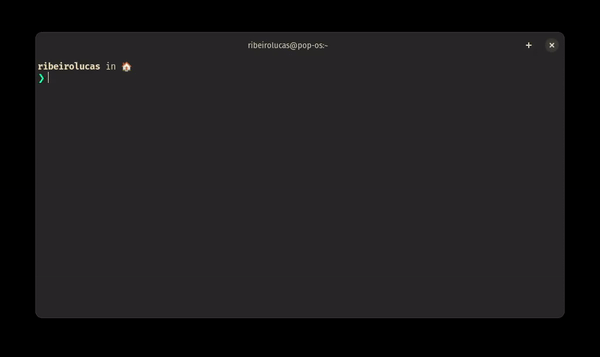

# blackbox-theme: A BlackBox's theme repo
Use this repo as theme-chooser and make your BlackBox Terminal more awesome!

## Prerequisites
Only two things:

- `wget` should be installed
- [`BlackBox`](https://gitlab.gnome.org/raggesilver/blackbox/) should be installed

## Using

### Installing the CLI tool
You can install using this command:
```console
sh -c "$(wget -nv -q -O- https://raw.githubusercontent.com/lucasvsr/blackbox-themes/main/src/install.sh)"
```

#### CLI

Choose a theme in [`themes`](themes/README.md) showcase and use the command:
```console
blackbox-theme <theme>
```



The theme should be downloaded at `$BLACKBOX_THEMES_DIR`.

### Manually
You can go at [`src/palletes`](src/palettes/) and copy the content of the theme you want and create a file `.json` in `$BLACKBOX_THEMES_DIR`.

For now, in both cases, you need to close and reopen BlackBox to see your theme at Theme seccion in settings.

## Add your theme in this repo
You can add your theme in this repo just:

- Creating a new branch and add you `theme.json` in `src/palettes`
- Add a screenshot in  `themes/images` and edit the `themes/README.md` with the image you just add.
- Make a pull-request at `main` branch
